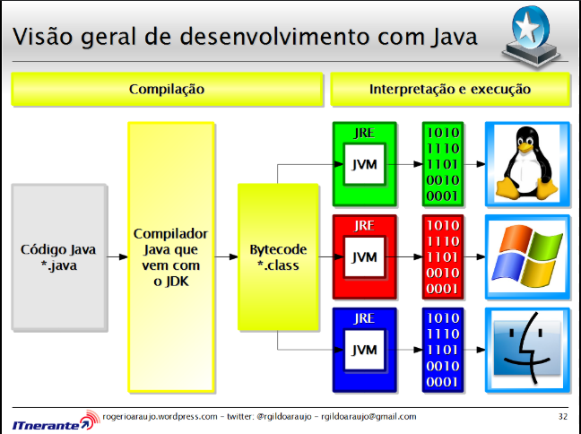

# Do 0 ao Java
### Como Funciona o Java ?

JVM - É Responsável por ler bytecode (Java Virtual Machine), é multiplataforma, roda em windows, linux, etc.  
Compilador JavaC - transforma o arquivo .java em .bytecode, assim esse arquivo vai conseguir ser lido pela JVM  
### Java Básico
Java é uma linguagem orientada a objetos, o que quer dizer que modelamos os objetos de acordo com suas características
e comportamentos da mesma forma que descrevemos um objeto do mundo real.   
  

Os códigos-fonte em Java devem ter a extensão .java,e o nome do arquivo deverá ser identico ao nome da classe.  
A palavra **class** define que o conteúdo entre chaves representa uma classe Java, a declaração do
**main** define um procedimento a ser executado, as palavras **public** e **static** significam que este metodo é 
público e estático, **void** significa que não há nada a ser retornado pelo método, **Strings[]
args** significa que o método aceita como argumento um array de strings chamado args. Dentro das 
chaves, o comando **System.out.println** significa que o conteúdo entre parenteses será impresso no console  
### Tipos Primitivos

Variaveis são um "espaço" alocado na memória do computador que armazena um valor e que pode ser associado 
a um nome simbolico. Esse espaço é chamado de variavel, pois o valor pode ser alterado. 
* byte
* short
* int
* long 
* float
* double 
* char
* boolean
    
Os tipos byte, short, int e long representam valores inteiros sendo capazes de armazenar
respectivamente 8, 16, 32, 64 bits. Os tipos float e double representam valores decimais,
sendo capazes de armazenar respectivamente 8, 16, 32 e 64 bits.  
Casting - Forçar o java a colocar o valor de uma variavel dentro da outra.  
### String 
É uma variavel de referencia, ou seja, a objetos.  

### Operadores aritméticos 

Os operadores aritméticos executam as operações fundamentais da matemática entre duas variáveis e
retornam o resultado. Caso seja preciso realizar operações mais complexas, é possível realizar 
combinações entre esses operadores e criar expressões.

+ +: operador de adição
+ -: operador de subtração
+ *: operador de multiplicação 
+ /: operador de divisão 
+ %: operador de módulo(resto de uma divisão).

### Operadores Relacionais 

Os operadores relacionais comparam dois opeandos e retornam como resultado um valor booleano. 
+ *>*: utilizado quando se deseja verificar se o valor de uma variável é maior que o valor de outra.
+ *>=*: utilizado quando se deseja verificar se o valor de uma variável é maior ou possui o mesmo valor que outra.
+ *<*: utilizado quando se deseja verificar se o valor de uma variável é menor que o valor de outra.
+ *<=*: utilizado quando se deseja verificar se o valor de uma variável é menor ou possui o mesmo valor que outra. 

